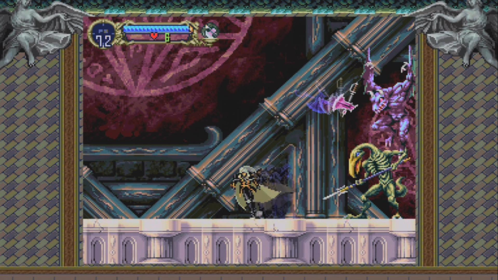

Cuando empiezas Symphony of the Night como Alucard, los primeros jefes que enfrentas no son solo obstáculos — cada uno esconde una historia. Aquí van los datos curiosos detrás de los primeros dos.

## Slogra y Gaibon: los jefes que ya existían antes del juego

El primer boss fight que enfrentas como Alucard es, en realidad, un reencuentro. Slogra y Gaibon no fueron creados para Symphony of the Night — ya habían aparecido, por separado, como dos de los jefes finales en Super Castlevania IV (1991), años antes de esta pelea. Aquí Konami los combinó en un solo enfrentamiento en equipo: Gaibon vuela y escupe bolas de fuego (que se vuelven más grandes y peligrosas cuando pierde la mitad de su vida), mientras Slogra ataca de cerca con su lanza.

Ambos son sirvientes directos de la Muerte, uno de los villanos recurrentes de la saga. Y hay un truco de estrategia poco conocido: si derrotas a Slogra primero, Gaibon agarra su cuerpo y te lo arroja como proyectil para un golpe masivo. Lo más seguro es derrotar a Gaibon primero.

## El Doppelganger: pelear contra tu propio reflejo

Justo antes de este segundo enfrentamiento, Alucard se topa con la Muerte, que le pide detenerse — no por debilidad, sino por respeto hacia él y hacia su padre. Cuando Alucard insiste en seguir adelante, la Muerte le roba toda su armadura, escudo y espada antes de irse volando. Así que llegas a esta pelea casi desarmado, con apenas la espada corta que encuentras de camino.

Tu rival, el Doppelganger, literalmente emerge de un espejo en medio del cuarto: es tu propio reflejo, con tu misma arma inicial. No tiene armadura ni escudo, pero compensa con más vida — y puede transformarse en murciélago si lo acorralas, una habilidad que tú todavía no tienes desbloqueada en ese punto del juego. Un dato curioso de esta pelea: "Red Rust", una espada notoriamente pésima que normalmente debilita a quien la usa, es la única situación en todo el juego donde realmente sirve — puede maldecir al Doppelganger y dejarlo sin poder atacar cuerpo a cuerpo.

---

*Fuentes: Castlevania Wiki (Fandom), GamerBolt, y análisis de la comunidad sobre el diseño y desarrollo de Symphony of the Night.*
